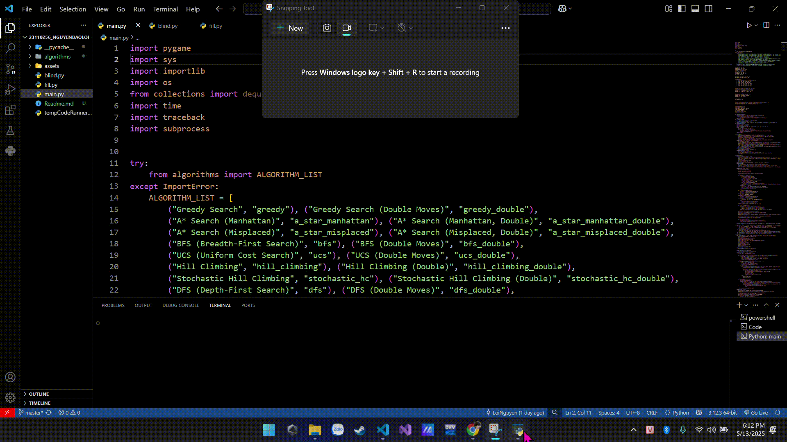
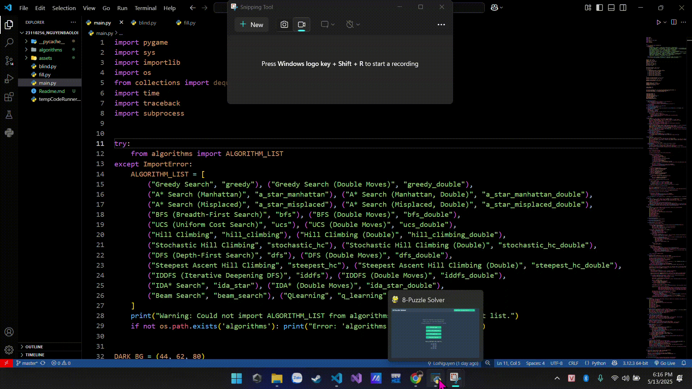
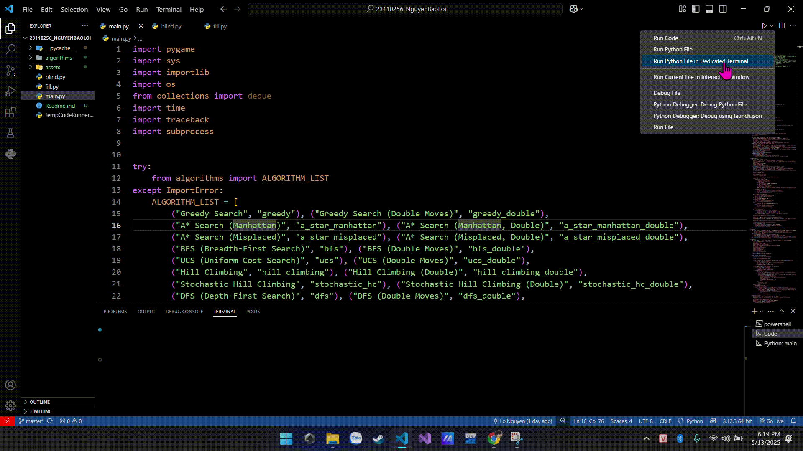
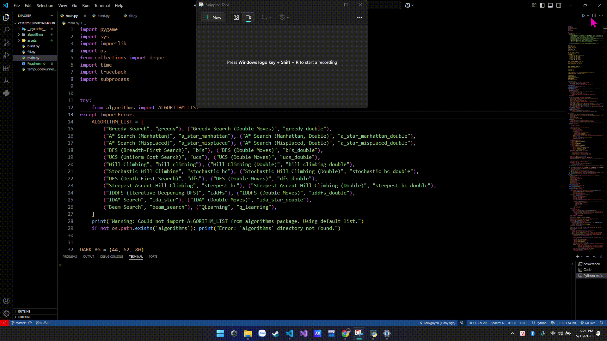

# 8-Puzzle Solver 🧩

Chào mừng bạn đến với 8-Puzzle Solver! Đây là một ứng dụng giúp bạn giải và trực quan hóa trò chơi 8-Puzzle cổ điển bằng một loạt các thuật toán tìm kiếm thông minh và học tăng cường. Ngoài ra, chương trình còn có một số tính năng phụ trợ thú vị.


-----------------------------------
## TÍNH NĂNG CHÍNH
-----------------------------------

### 1. Giải Puzzle Tương Tác
*   Giao diện đồ họa trực quan, dễ sử dụng.
*   Hiển thị trạng thái ban đầu của puzzle.
*   Trực quan hóa từng bước di chuyển của các ô số để đạt đến trạng thái đích.

    <!-- GIF Demo Giải Puzzle Tương Tác -->
    

### 2. Lựa chọn Thuật Toán Đa Dạng
Người dùng có thể chọn một trong các thuật toán sau để giải puzzle. Nhiều thuật toán có thêm tùy chọn "(Double Moves)" cho một biến thể đặc biệt:

*   **Thuật toán Tìm kiếm Heuristic (Informed Search):**
    *   Greedy Search
    *   Greedy Search (Double Moves)
    *   A* Search
    *   A* Search (Double Moves)
    *   IDA* Search (Iterative Deepening A*)
    *   IDA* Search (Double Moves)
    *   Beam Search
    *   Beam Search (Double Moves)
*   **Thuật toán Tìm kiếm Mù (Uninformed Search):**
    *   BFS (Breadth-First Search - Tìm kiếm theo chiều rộng)
    *   BFS (Double Moves)
    *   UCS (Uniform Cost Search - Tìm kiếm chi phí đồng nhất)
    *   UCS (Double Moves)
    *   DFS (Depth-First Search - Tìm kiếm theo chiều sâu)
    *   DFS (Double Moves)
    *   IDDFS (Iterative Deepening Depth-First Search)
    *   IDDFS (Double Moves)
*   **Thuật toán Tìm kiếm Cục bộ (Local Search):**
    *   Hill Climbing
    *   Hill Climbing (Double Moves)
    *   Stochastic Hill Climbing
    *   Stochastic Hill Climbing (Double Moves)
    *   Steepest Ascent Hill Climbing
    *   Steepest Ascent Hill Climbing (Double Moves)
    *   Simulated Annealing
    *   Simulated Annealing (Double Moves)
*   **Học Tăng Cường (Reinforcement Learning):**
    *   QLearning

*   **Ghi chú về "(Double Moves)":** Biến thể này có thể ám chỉ một cơ chế cho phép hai ô trống di chuyển cùng lúc (nếu có hai ô trống trong một biến thể của puzzle) hoặc một dạng tối ưu hóa/thay đổi cách thuật toán gốc khám phá không gian trạng thái, có thể liên quan đến việc xem xét các hành động kép hoặc mở rộng trạng thái theo cặp.

    <!-- GIF Demo Lựa Chọn Thuật Toán (Nếu có) -->
   

### 3. Điều Khiển Trực Quan Hóa
*   **Tốc độ:** Thanh trượt cho phép điều chỉnh tốc độ của hoạt ảnh giải puzzle (từ nhanh đến chậm, hiển thị thời gian trễ mili giây).
*   **Auto: On/Off:** Bật/tắt chế độ tự động chạy các bước giải.
*   **Tiếp theo:** Xem từng bước giải một cách thủ công khi chế độ Auto đang Off.
*   **Làm lại:** Chạy lại hoạt ảnh giải từ đầu với trạng thái ban đầu.
*   **Quay lại Menu:** Trở về màn hình chính.

    <!-- GIF Demo Điều Khiển Trực Quan Hóa -->
    

### 4. Thông Tin Giải
*   Hiển thị thuật toán đang được sử dụng.
*   Số Node đã duyệt (Nodes explored).
*   Độ dài đường đi (Path length) của lời giải.
*   Bước hiện tại / Tổng số bước.
*   Thời gian tìm kiếm (Search time).
*   Danh sách các bước giải chi tiết (trạng thái puzzle ở mỗi bước).

    <!-- GIF Demo Thông Tin Giải (Nếu có) -->
   

### 5. Chỉnh Sửa Trạng Thái (Nút "Chỉnh sửa trạng thái")
Cho phép người dùng tùy chỉnh trạng thái ban đầu của puzzle để giải.

    <!-- GIF Demo Chỉnh Sửa Trạng Thái -->
  

### 6. Tìm Kiếm Mù (Nút "Tìm kiếm mù")
*   Trình bày và giải đồng thời nhiều trạng thái puzzle ban đầu (trong video là 2 ví dụ).
*   Hiển thị hoạt ảnh các bước di chuyển chung (nếu có) và sau đó là các bước riêng để đạt đến trạng thái đích.
*   Thông báo khi tất cả các trạng thái đã đạt được mục tiêu.

    <!-- GIF Demo Tìm Kiếm Mù Đa Trạng Thái -->
    
### 7. Hoạt Ảnh Điền Số (Nút "Hoạt ảnh điền số")
*   Một tính năng phụ trợ trực quan hóa quá trình điền các số từ 1 đến 9 vào một lưới 3x3.
*   Người dùng có thể chọn "Trạng Thái Đích" (cấu hình số cuối cùng) trước khi bắt đầu hoạt ảnh.
*   Trong video, hoạt ảnh này sử dụng phương pháp "Backtracking" (hoặc một phương pháp tương tự) để điền các số tuần tự vào lưới.

    <!-- GIF Demo Hoạt Ảnh Điền Số -->
   
-----------------------------------
## CÔNG NGHỆ SỬ DỤNG
-----------------------------------
*   
*    <!-- Màu badge có thể không chính xác, bạn có thể tự tùy chỉnh -->

-----------------------------------
## CÀI ĐẶT VÀ CHẠY ỨNG DỤNG
-----------------------------------
1.  **Yêu cầu:**
    *   Đảm bảo bạn đã cài đặt [Python](https://www.python.org/downloads/) (phiên bản 3.x được khuyến nghị).
    *   Cài đặt thư viện Pygame.

2.  **Cài đặt Pygame:**
    Mở terminal hoặc command prompt và chạy lệnh sau:
    ```bash
    pip install pygame
    ```

3.  **Tải mã nguồn:**
    Clone repository này về máy của bạn:
    ```bash
    https://github.com/LoiNguyen2k5/PuzzleProjectt
    cd PuzzleProjectt
    ```
    Hoặc tải về dưới dạng file ZIP và giải nén.

4.  **Chạy ứng dụng:**
    Chạy file Python chính của chương trình (giả sử là `main.py`):
    ```bash
    python main.py
    ```
    *(Lưu ý: Thay `main.py` bằng tên file thực thi chính của bạn nếu khác.)*

-----------------------------------
## CẤU TRÚC THƯ MỤC (Gợi ý)
-----------------------------------
PuzzleProjectt/
├── assets/
│ └── gifs/
│ ├── BlindSearch.gif
│ ├── DieuKhienTrucQuanHoa.gif
│ ├── ChinhSuaTrangThai.gif
│ ├── DemoChonThuatToan.gif
│ ├── GiaiThuatToan.gif
│ └── BackTracking.gif
├── main.py # File chạy chính của bạn
├── README.md # File bạn đang chỉnh sửa
└── ... # (Các file và thư mục khác của project)